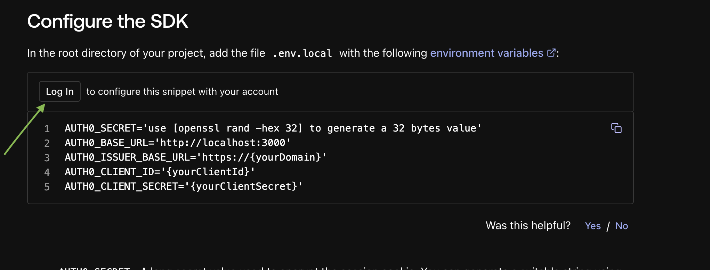

## 🎤 The behavioral mock interview app powered by AI

### Project Overview

This project targets job seekers aiming to enhance their interview skills through a behavioral mock interview application, powered by artificial intelligence. Leveraging the Deepgram API, the app identifies and timestamps filler words, enabling it to pinpoint pauses in speech. Additionally, it utilizes the Google Gemini API to assess the user's recorded responses, preceded by a prompt, offering constructive feedback on their performance. Users are presented with interview questions, and the app evaluates their verbal responses. The application assigns a performance score based on the comprehensive analysis of speech patterns, filler words, and pauses. The backend of this application is developed using Flask, while the frontend is crafted with Next.js.

# Table of Contents

1. [Project Overview](#project-overview)
2. [Project Directory](#project-directory-anchor)
3. [Quick Start](#quick-start)
   - [Clone and Install](#clone-and-install)
   - [Environment Variables](#environment-variables)
   - [Configuring Auth0](#configuring-auth0)
   - [Start Virtual Environment](#start-virtual-environment)
   - [Running the Flask API](#running-the-flask-api)
   - [Running Concurrently](#running-concurrently)
   - [Running Just the Next.js App](#running-just-the-nextjs-app)

<strong><a id="project-directory-anchor"></a>📁 Project Directory</strong>

<details>
<summary>Click to expand</summary>

```.
├── liftoff (<- Just a reference)
├── mock_ai
│   ├── README.md
│   ├── flask_api (<- Flask API)
│   │   ├── index.py
│   │   ├── env.example
│   │   ├── .env *
│   │   ├── tmp
│   │   ├── audio_analysis.py
│   │   ├── database.py
│   │   ├── genai_utils.py
│   │   ├── sample-data
│   ├── app
│   │   ├── api
│   │   ├── interview
│   │   ├── results
│   │   ├── globals.css
│   │   ├── layout.tsx
│   │   ├── page.tsx
│   ├── components
│   ├── hooks
│   ├── types
│   ├── .env.local
│   ├── next-env.d.ts
│   ├── next.config.mjs
│   ├── package-lock.json
│   ├── package.json
│   ├── postcss.config.mjs
│   ├── public
│   ├── requirements.txt
│   ├── tailwind.config.ts
│   ├── tsconfig.json
│   ├── types
│   ├── MockAI.db
│   └── venv*
│   └── README.md
└── README.md

* denotes that this directory is not included in the repository.
```

</details>
<br>
<br>

# Quick start

### Clone and Install

To set up the project, follow these steps:

1. **Clone the repository**: Use the following command to clone the `mockAI` repository to your local machine.

   ```bash
   git clone git@github.com:jvrjsanchez/mockAI.git
   ```

2. **Navigate to the project directory**: Change your current directory to the `mock_ai` folder.

   ```bash
   cd mock_ai
   ```

3. **Install dependencies**: Run the following command to install the necessary Node.js packages defined in the `package.json` file.

   ```bash
   npm install
   ```

### Environment Variables

To set up the necessary environment variables:

1. Navigate to the `flask_api` directory within the project.
2. Locate the `.env.example` file. This file contains a template of the environment variables required by the project.
3. Create a new file named `.env` in the same directory.
4. Copy the contents of `.env.example` into your `.env` file.
5. Replace the placeholder values with your own API keys.
6. Enter a prompt to be used for the AI analysis. This can be any text you choose.


```bash
DG_API_KEY="your_deepgram_api_key_here"
GOOGLE_API_KEY="YOUR_GEMINI_API_KEY_HERE"
PROMPT_TO_AI="YOUR_PROMPT_HERE"
```

Get your free API keys for [Deepgram](https://www.deepgram.com/) ,and [Gemini API Key](https://aistudio.google.com/app/apikey).

---

### Configuring Auth0
Refer to the [Auth0 documentation](https://auth0.com/docs/quickstart/webapp/nextjs) to set up your Auth0 account and configure the necessary settings.

> 💡 **Tip:** If you click login under the 'Configure The SDK' section, the values will be populated for you.



In the root directory of the project, create a `.env.local` file and add the following environment variables:

```bash
AUTH0_SECRET='use [openssl rand -hex 32] to generate a 32 bytes value'
AUTH0_BASE_URL='http://localhost:3000'
AUTH0_ISSUER_BASE_URL='https://{yourDomain}'
AUTH0_CLIENT_ID='{yourClientId}'
AUTH0_CLIENT_SECRET='{yourClientSecret}'
```

### Start Virtual Environment

Start your Python virtual environment.

```bash
python3 -m venv venv
source venv/bin/activate
```

### Running the Flask API

To run the Flask API as a `standalone` run the following commands: `Note: This script will install the requirements.txt file for you.`

```bash
npm run flask-dev
```

### Running Concurrently

To run the Next.js and Flask api `concurrently`, run the following command. This will also install the requirements.txt file for the Flask API:

```bash
npm run dev
```

Flask API will be running on `http://localhost:3001` and the Next.js app will be running on `http://localhost:3000`.

### Running Just the Next.js App

To run `just` the Next.js app, run the following command:

```bash
npm run client
```
